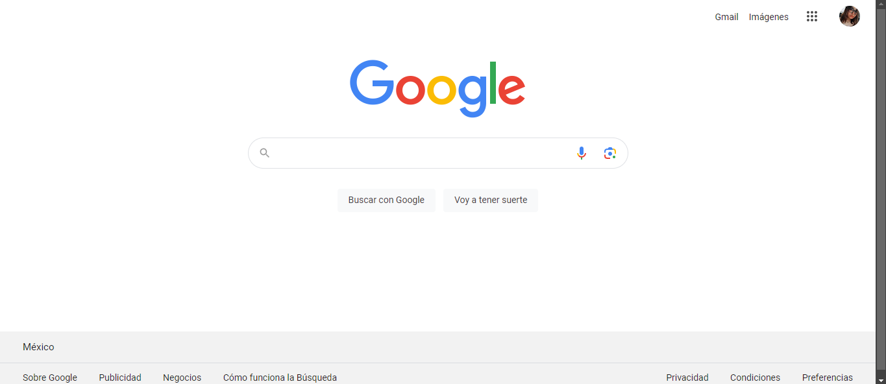

# Clon de Google

El presente proyecto consiste en un clon de la página de búsqueda de Google desarrollado con HTML y CSS para aplicar los conocimientos obtenidos en el bootcamp Tecnolochicas PRO Summer Camp.

[Proyecto Desplegado: https://r-clon-google.netlify.app/](https://r-clon-google.netlify.app/)

## Imagen del sitio

## Tecnología
* HTML
* CSS

---
Desarrollado por [Rocío Guevara](https://github.com/RocioGV) en [Tecnolochicas PRO](https://tecnolochicas.mx/).